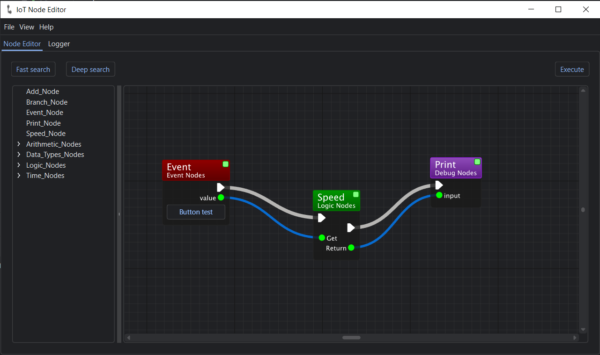

<br>

<div align="center">

[](https://hydralauncher.site)

  <h1 align="center">IoT BluePrints</h1>
  
  <p align="center">
    <strong>IoT BluePrints was created to simplify the creation of scenarios and control of your smart home 
using user-friendly interface of blue-prints.</strong>
  </p>

[](https://github.com)

[](README.md)
[](README.ru.md)




</div>

## Table of Contents

- [About](#about)
- [Features](#features)
- [Installation](#installation)
- [Contributing](#contributing)
  - [Join our Telegram](#join-our-telegram)
  - [Fork and clone your repository](#fork-and-clone-your-repository)
  - [Ways you can contribute](#ways-you-can-contribute)
  - [Project Structure](#project-structure)
- [Build from source](#build-from-source)
  - [Install Python 3.10](#install-python-310)
  - [Install Python Dependencies](#install-python-dependencies)
- [Running](#running)
- [Contributors](#contributors)

## About

Our idea and philosophy. 

## Features

## Installation

## Contributing

### Join our Telegram

### Fork and clone your repository

1. Fork the repository [(click here to fork now)](https://github.com)
2. Clone your forked code `git clone https://github.com/your_username/BluePrints`
3. Create a new branch
4. Push your commits
5. Submit a new Pull Request

### Ways you can contribute


### Project Structure


## Build from source

### Install Python 3.10

Ensure you have Python 3.10 or newer installed on your machine. 
You can download and install it from [python.org](https://www.python.org/downloads/).

### Install Python Dependencies

Install the required Python dependencies using pip:

```bash
pip install -r requirements.txt
```

## Running
```bash
 python main.py
```

## Contributors

<a href="https://github.com/Mooncake911/BluePrints/graphs/contributors">
  
</a>

## License

IoT BluePrints is licensed under the [MIT License](LICENSE).